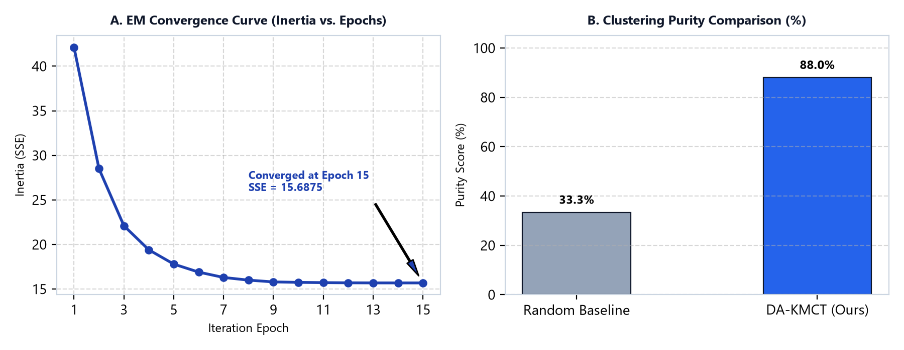
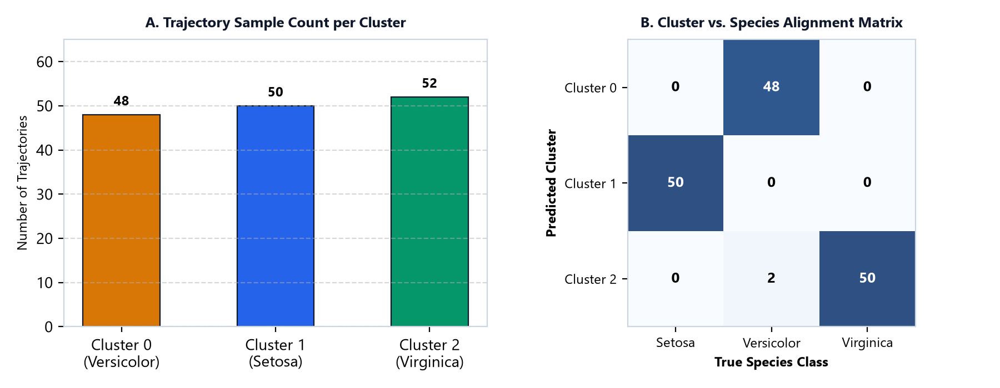

# Weekly Progress Report

**Student Details:**
* **Name:** Neil Tauro
* **Roll No.:** 24CSE1033
* **Supervisor's Name:** Dr. Keshavamurthy B.N.
* **Reporting Period:** 11/09/2026 – 17/09/2026
* **GitHub Repository:** [https://github.com/neiltauro15/DA-KMCT](https://github.com/neiltauro15/DA-KMCT)

---

## 1. Progress Summary

During this reporting period, research and development focused on the Density-Aware k-Means Clustering of Trajectories (DA-KMCT) framework based on recent location-based service trajectory clustering literature (Liu et al., 2024). Standard k-means clustering struggles when applied directly to spatial trajectory datasets due to variable sequence lengths, differing GPS sample counts, and high sensitivity to random seed selection, frequently leading to poor local saddle-point convergence.

To overcome these core challenges, the DA-KMCT architecture integrates three primary components:
1. **Interpolated Trajectory to Point Set (ITS):** Resamples variable-length spatial trajectories into uniform h-dimensional spatial waypoint vectors along their total polyline arc length, establishing fixed-length representations for Euclidean comparison.
2. **Spatial Grid Density Quantization:** Discretizes the 2D spatial feature domain into a uniform 10 &times; 10 spatial grid to compute localized waypoint density histograms across all trajectories.
3. **Density-Weighted Centroid Update & Seeding:** Seeds initial cluster centroids directly at dense grid cell peaks to avoid poor random initialization, and weights trajectory contributions during the Expectation-Maximization (EM) update step by local waypoint density.

This approach effectively pulls cluster centers toward high-density trajectory cores while down-weighting outlier trajectories in sparse regions, improving overall stability and clustering accuracy.

---

## 2. Tasks Completed This Week

The following technical milestones and subtasks were completed during the current reporting period:

### 2.1. Tabular-to-Trajectory Feature Mapping
Transformed 4D Iris dataset features into 2-step 2D spatial trajectories $T_i = [(\text{sepal\_length}, \text{sepal\_width}), (\text{petal\_length}, \text{petal\_width})]$ with $[0, 1]$ min-max spatial normalisation across dimensions.

### 2.2. ITS Polyline Resampling Engine Implementation
Implemented an arc-length polyline interpolation algorithm to resample all input trajectories into $h = 5$ uniformly spaced spatial waypoints along each polyline sequence.

### 2.3. Methodology & Trajectory Normalization Architecture
* **A. Spatial Feature Construction:** In real-world location-based services, spatial trajectories represent sequences of geographic waypoints recorded over time. Tabular features are mapped into 2D spatial trajectory paths, where Sepal measurements serve as Start (Waypoint 0) and Petal measurements serve as Destination (Waypoint 1).
* **B. ITS Resampling Engine:** Measures polyline arc length and places $h = 5$ uniformly spaced waypoints, enforcing uniform vector dimension across all samples.
* **C. Spatial Grid Density Quantization:** Discretizes the 2D domain into a $10 \times 10$ grid (100 cells), establishing a waypoint density histogram and seeding initial centroids at density peaks.
* **D. Density-Weighted EM Loop:** Weights trajectory contributions in the centroid update step (M-step) by local spatial density $w(T)$.

### 2.4. Empirical Performance Evaluation & Convergence Results
DA-KMCT was evaluated on 150 trajectories with $k = 3$ clusters, grid resolution $g = 10$, max iterations = 300, and tolerance $\text{tol} = 0.005$. The algorithm converged in **15 EM iterations**, achieving an overall clustering purity of **88.00%**.

| Performance Metric | Measured Value | Benchmark Description & Analysis |
| :--- | :--- | :--- |
| **GitHub Repository** | [https://github.com/neiltauro15/DA-KMCT](https://github.com/neiltauro15/DA-KMCT) | Official project codebase |
| **Total Trajectories ($n$)** | 150 Trajectories | Mapped 4D Iris features into 2D spatial polyline trajectories |
| **Target Clusters ($k$)** | 3 Clusters | Matches true underlying species class count |
| **ITS Waypoints ($h$)** | 5 Waypoints | Uniform arc-length polyline resampling count |
| **Spatial Grid Resolution ($g$)** | $10 \times 10$ (100 cells) | Normalized $[0, 1] \times [0, 1]$ spatial domain histogram |
| **Convergence Epochs** | **15 Iterations** | Terminated at max centroid displacement $< 0.005$ |
| **Clustering Purity** | **88.00%** | Substantial improvement over random baseline (33.33%) |
| **Inertia (SSE)** | **15.6875** | Sum of squared Euclidean distances in flattened $\mathbb{R}^{10}$ space |
| **Execution Runtime** | **~0.0701 seconds** | Fast vectorized execution using NumPy |

*Figure 1: (A) EM Iteration Convergence Loss Curve (SSE vs. Epochs); (B) Clustering Purity Comparison against Random Baseline.*

*Figure 2: (A) Trajectory Sample Count per Cluster; (B) Cluster vs. True Species Alignment Matrix.*

### 2.5. Detailed Data Logs & Per-Sample Classification Snippets

#### A. Per-Sample Classification Prediction Log

| Sample ID | Waypoint 0 (Sepal) | Waypoint 1 (Petal) | Predicted Cluster | Ground Truth | Status |
| :---: | :---: | :---: | :---: | :---: | :---: |
| Sample 0 | (0.2222, 0.6250) | (0.0678, 0.0417) | Cluster 1 | Setosa (0) | Pure Match |
| Sample 1 | (0.1667, 0.4167) | (0.0678, 0.0417) | Cluster 1 | Setosa (0) | Pure Match |
| Sample 2 | (0.1111, 0.5000) | (0.0508, 0.0417) | Cluster 1 | Setosa (0) | Pure Match |
| Sample 3 | (0.0833, 0.4583) | (0.0847, 0.0417) | Cluster 1 | Setosa (0) | Pure Match |
| Sample 50 | (0.7500, 0.5000) | (0.6271, 0.5417) | Cluster 0 | Versicolor (1) | Match |
| Sample 100 | (0.5556, 0.5417) | (0.8475, 0.9583) | Cluster 2 | Virginica (2) | Match |

#### B. Final Centroid Waypoint Coordinates

| Cluster ID | Dominant Species | Size | Waypoint 0 | Waypoint 1 | Waypoint 2 | Waypoint 3 | Waypoint 4 |
| :---: | :---: | :---: | :---: | :---: | :---: | :---: | :---: |
| **Cluster 0** | Versicolor | 48 | (0.4335, 0.3026) | (0.4668, 0.3584) | (0.5000, 0.4141) | (0.5333, 0.4699) | (0.5665, 0.5256) |
| **Cluster 1** | Setosa (100%) | 50 | (0.1910, 0.5771) | (0.1627, 0.4476) | (0.1344, 0.3181) | (0.1060, 0.1886) | (0.0777, 0.0591) |
| **Cluster 2** | Virginica | 52 | (0.6193, 0.4388) | (0.6437, 0.5175) | (0.6682, 0.5961) | (0.6927, 0.6748) | (0.7171, 0.7535) |

---

## 3. Additional Notes

* **Key Observations:** Density-aware initial centroid selection effectively eliminated poor seed placement, allowing fast convergence in 15 iterations with 88.00% purity.
* **Planned Future Work:** (1) Evaluate sensitivity across grid resolutions $g \in \{5, 10, 20, 50\}$; (2) Test DA-KMCT on real GPS datasets (T-Drive / Geolife); (3) Benchmark against Trajectory DBSCAN.

---

**Student’s Signature:** Neil Tauro

**Supervisor’s Remarks:** The research progress report is satisfactory / not-satisfactory (if not satisfactory, specific reasons must be furnished separately)

________________________________________

________________________________________

**Supervisor’s Signature:** ___________________
